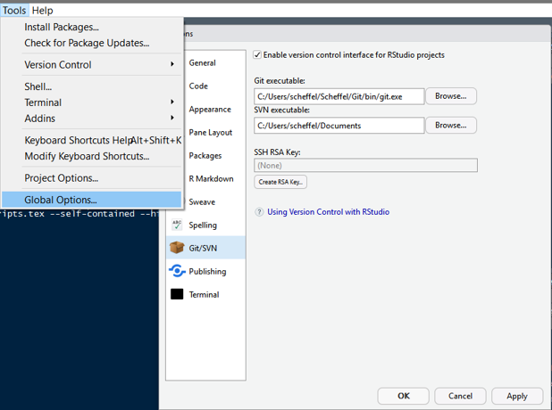
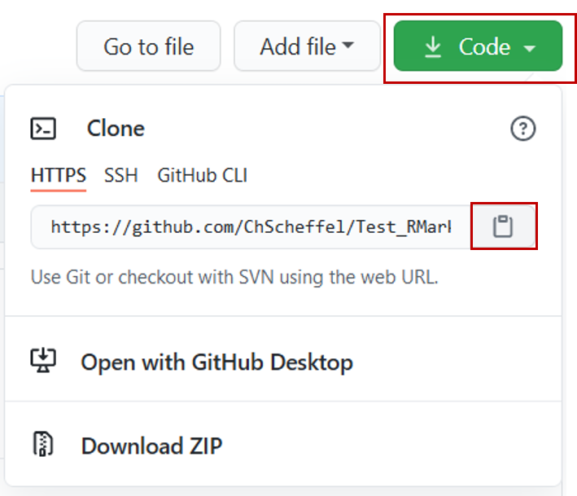
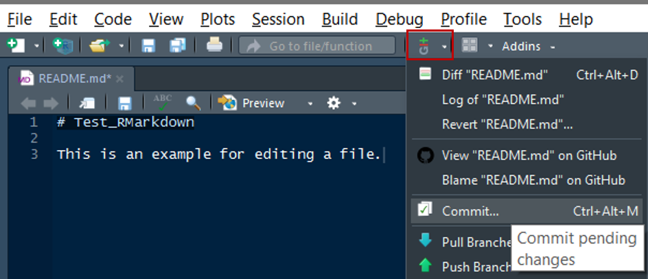
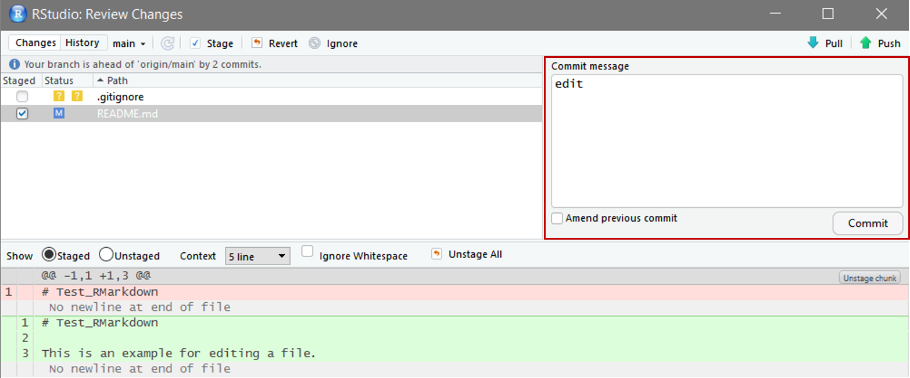
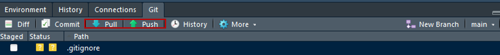

```{r setup, include = FALSE}
library(knitr)
knitr::opts_chunk$set(echo = F)
```

## Preliminary Notes

This tutorial is intended to facilitate collaborative work on R analyses and R Markdown manuscripts. 
While results from R analyses including figures and tables can be automatically integrated into the text of a manuscript written using R Markdown and formatted using the *papaja* package (see the previous lessons), one drawback in using R Markdown, however, is that collaborative work is made more difficult because annotations and comments are difficult to insert.
This can be at least partially solved with the help of GitHub.
Since there is a multitude of implementation possibilities, this tutorial does not claim to be exhaustive.
All information listed here have been drawn and prepared from various documentations and tutorials, for example:

- [Happy Git and GitHub for the useR](https://happygitwithr.com/index.html)
- [Version Control with Git and SVN](https://support.rstudio.com/hc/en-us/articles/200532077-Version-Control-with-Git-and-SVN)
- [GitHub and RStudio](https://resources.github.com/whitepapers/github-and-rstudio/)
- [Reproducible Research using R Markdown and Overleaf](https://static1.squarespace.com/static/5757268f7da24f26ca7b21d2/t/5c7587114192021796d7cc84/1551206162093/R_Overleaf_Integration.pdf)
- [A Reproducible Data Analysis Workflow with R Markdown, Git, Make, and Docker](https://psyarxiv.com/8xzqy/)

First, you will make all the necessary preparations in RStudio and GitHub. 
Then you will learn how to work collaboratively on scripts and texts. 

# Set up Git and RStudio

## GitHub and Git

First, you have to sign up at [GitHub](https://github.com/) and download Git. If you have trouble installing Git, you may want to resort to the following guides:

- [GitHub's Git Guides](https://github.com/git-guides/install-git)
- [Happy Git With R](https://happygitwithr.com/install-git.html) 

As mentioned in the first of these guides, Git is automatically installed if you install the GitHub client, and we strongly recommend to do so for a number of reasons mentioned below. Download it here:

- [GitHub Desktop](https://desktop.github.com)

_Attention! If you use Windows, Git will automatically be installed into you C:/Program Files/ directory. Often, the space in the directory name causes problems._ 
_Therefore, I would recommend to choose a differenct directory for installation._

## RStudio

Now that Git is installed, you need to link it to RStudio. 
Open RStudio and go to `Tools > Global Options`. 
Navigate to `Git/SVN`, check `Enable version control interface for RStudio projects` and paste the path to your Git executable in the corresponding field and click `OK`.

```{r img1, echo = FALSE, fig.cap = "", fig.align = "center", out.width = "75%"}

``` 

Now everything is set up and you can start a new project!

# Projects in Git and R

## Create new projects

First you need to set up a new repository on GitHub. 
Sign in on GitHub, go to the \textsc{+} in the top right corner and click on `New repository`. 
Choose an appropriate name that you can easily remember. 
As there will be created folders later on, I would not recommend to use blank spaces in your names. 
Further, I recommend adding a _README_ file where you can write extensive descriptions of your projects. 
Click on `Create Repository` and you are good to go! 
Make note of the GitHub address for you repository. Click on `Code` and now on the Notepad symbol next to the HTTPS address. 
The address to our repository is now stored in the clipboard. 

```{r img2, echo = FALSE, fig.cap = "", fig.pos = "h", fig.align = "center", out.width = "30%"}

``` 

## Integrate projects in RStudio

Open RStudio an click on `File > New Project`. <!-- comment in R Markdown-->
Select the option `Version Control > Git`.  
Now paste the address of your Git repository in the first line. 
A new folder with the exact name of your Git repository will be created as subdirectory. 
_Do not change the folder name!_ 
The location can be specified in the third line. 
All files from the Git repository are now copied to the local folder and you should be able to see all files from this repository in the `Files` tab inside of RStudio. 
Now your R project is linked to the Git repository and you can start working.

## Committing

You can create and edit files in RStudio as you are used to. 
For example you could open and edit the README file, you created in the Git repository. Now you have to commit changes to the Git repository. 
Click on the `Version Control` button in the control panel and select `Commit`. 

```{r img3, echo=FALSE, fig.cap="", fig.pos="h", fig.align="center", out.width = '50%'}

```

A new window opens were you can review all changes made. 
Add a comment explaining briefly all changes you made since the last commit and click on \textsc{Commit}.  

```{r img4, echo = FALSE, fig.cap = "", fig.pos = "h", fig.align = "center", out.width = "50%"}

```
All committed files should now disappear in the _Git_ tab. 

## If all this doesn't work ...

... because you get an error that a *personal access token* is required, go get one following [this tutorial](https://docs.github.com/en/authentication/keeping-your-account-and-data-secure/creating-a-personal-access-token) or proceed as described here:

- [GitHub and the `renv` package](https://github.com/alex-strobel/DPP-LabManual/blob/main/Manuals/GitHub_and_renv/GitHub_and_renv_short.md)

We really recommend to use the [`renv` package](https://github.com/alex-strobel/DPP-LabManual/wiki/R-package-renv) for collaborative work on R projects because all collaborators will use the same R environment, even when having installed different versions of certain packages employed.

## Pushing and Pulling

If you start working with your project, you should always _pull_ the latest version from your Git repository from GitHub. 
Further, once you committed all your changes, you can _pull_ the latest version of the Git repository from GitHub. 
After you finished _pulling_ you can _push_ your changes to the Git repository (i.e., upload your changes). 
_Pulling_ and _pushing_ is the essential feature for collaborative work! So make sure you and your collaborators always work with up to date files.  
*Note*}*: The sequence of buttons on the RStudio git panel (that you can see in the picture) matches the sequence of actions necessary to submit changes to Git repository.

```{r img5, echo = FALSE, fig.cap = "", fig.pos = "h", fig.align = "center", out.width = "100%"}

```

# Collaborative writing with R Markdown scripts

In this section we want to show you one way how collaborative writing works with your reproducible manuscripts.

## Branching

Branching is great for working on a project as a team.
In short, a branch is a copy of the whole project.
You can try out ideas in your branch, or comment texts, without affecting the \textsc{main} project.
After all comments have been edited, you can merge your branch into the main branch.
Once merged, pull requests preserve a record of the historical changes of your code.


More detailed information on branching can be found here: https://guides.github.com/introduction/flow/ .


## Recommended workflow

1. Author A writes the first draft of the manuscript.
2. Author B branches the project in GitHub, checks the code and makes edits.
3. Author B pushes the changes only in the seperate branch and adds comments in the commit log.
4. After author B is done, a pull request is created to merge the edits of the seperate branch to the main branch.
Author A can see all changes and comments in the commit log.
5. Author A implements edits and responds to comments. 

## Tips and tricks

Finally, here are some tips and tricks that that can facilitate collaborative writing:

1. In your R Markdown file, use a new line for each sentence (as you can see in this *.Rmd* document). 
Otherwise, GitHub will mark the whole paragraph although a co-worker only changed one sentence, because all sentences were in the same line.
2. Work with small commits! For every change or comment you make, commit the change. 
If you do all your changes and pull the whole file at the end, it gets very chaotic.
3. Everything gets a lot easier if you split you manuscript in several *.Rmd* files. 
We recommend using an own *.Rmd* file for each section and put them together in a master document (note: we still have to find out whether this works with the *papaja* package) via, e.g.,

```{r child = "Part1.Rmd"}
```

```{r child = "Part2.Rmd"}
```

## Closing remarks

So, this is it! This is the way how we at the Differential and Personality Group at the Faculty of Psychology at the TU Dresden write our manuscripts and organize our collaborative writing. More likely than not you will get a lot of error messages when trying to implement our work flow in your routines. Just view this as part of the execise ... 